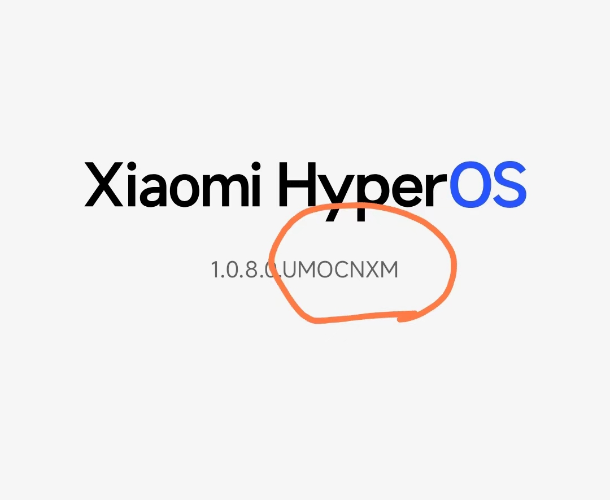

# What's this?
This is a collection of earliest Setting app apk file of HyperOS.
If the error code `10000` occurred when unlock BootLoader using [Xiaomi HyperOS BootLoader Bypass](https://github.com/MlgmXyysd/Xiaomi-HyperOS-BootLoader-Bypass), you can try to install the old version Settings app and unlock again.

# About the version
The Settings app apk file name format:
```
Settings_<code name>_from_OSx.x.x.x.<ROM code>.apk
```

for example:
```
Settings_GARNETEEAGlobal_from_OS1.0.8.0.UNREUXM.apk
```

## How to find the correct apk file for your XiaoMi/RedMi device
Check the `ROM code` on you phone:
* Settings -> My device

for example:


download the apk file that the file name including your `ROM code`.

# APK files
If you can not find the proper apk file, please put your "ROM code" [here](https://github.com/code4fun1024/setting-app-for-hyperos/issues/1), I will extract it on priority on my free time.

* [Settings_GARNETEEAGlobal_from_OS1.0.8.0.UNREUXM.apk](https://drive.google.com/file/d/18VGV58Ci9eCs4TgR2ZCNdtAhE0fS5tIG/view?usp=sharing)
* [Settings_DIZIGlobal_from_OS1.0.1.0.UNSMIXM.apk](https://drive.google.com/file/d/1pDqKStGz42uGHDy-KMpNccajQLnioB-r/view?usp=sharing)
* [Settings_AGATEGlobal_from_OS1.0.2.0.UKWMIXM.apk](https://drive.google.com/file/d/1GI9jXEfUGecSeJ8X2fj7qmc8hYgDK4CI/view?usp=sharing)
* [Settings_FIREINGlobal_from_OS1.0.1.0.UMXINXM.apk](https://drive.google.com/file/d/14a42VhXgNXXAOQ_qweeCqqi2T480ucLQ/view?usp=sharing)
* [Settings_ZIRCONGlobal_from_OS1.0.1.0.UNOMIXM.apk](https://drive.google.com/file/d/1bMDkd_L0FJMGkdn3tbzO2_kVy8Edn3A3/view?usp=sharing)